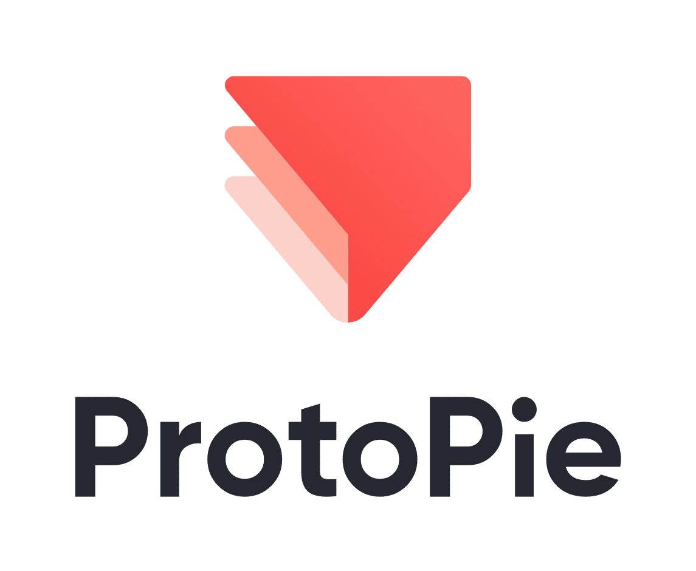
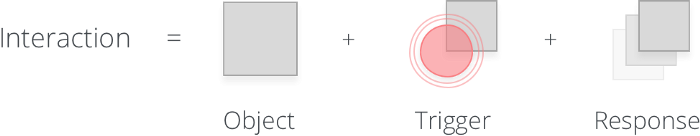
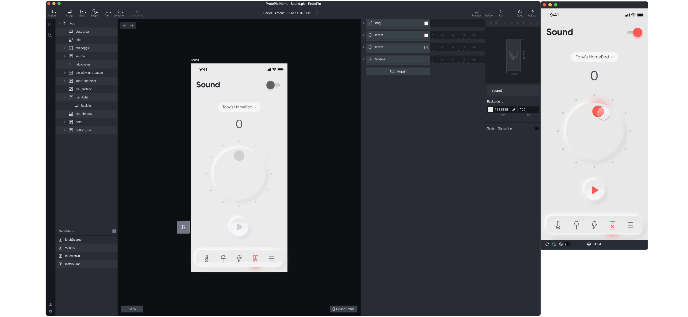
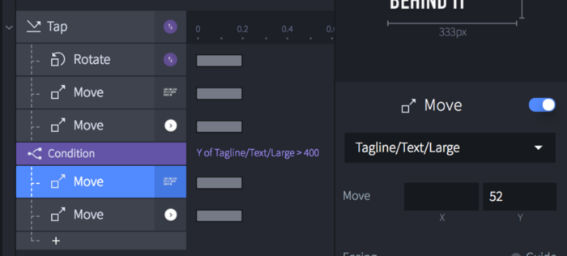
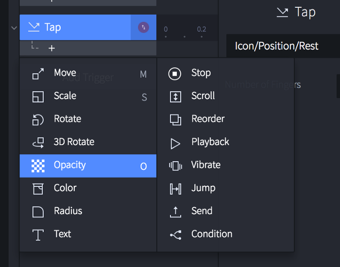
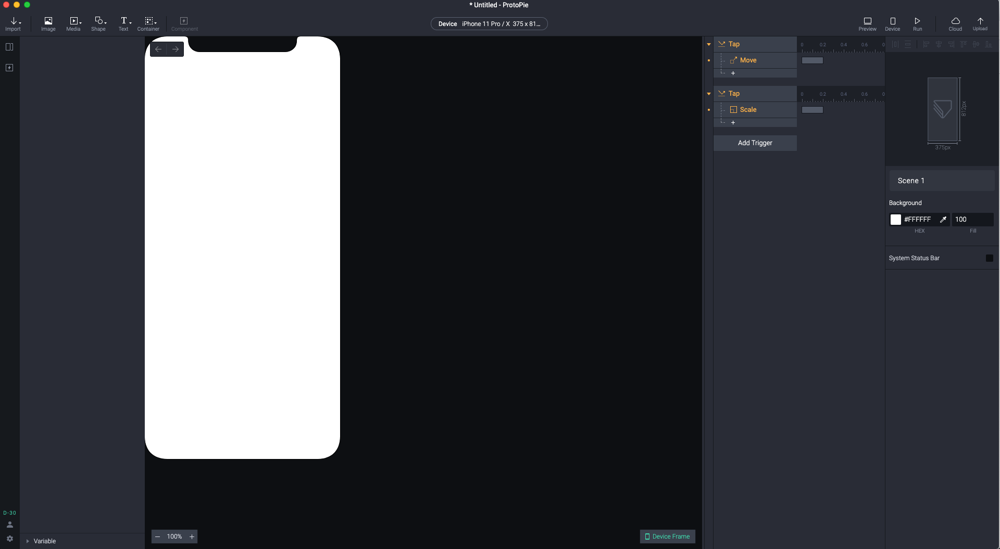
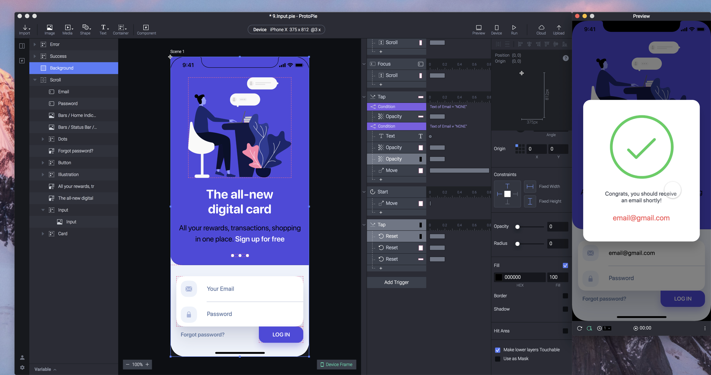
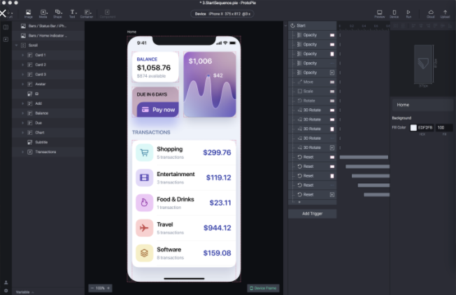
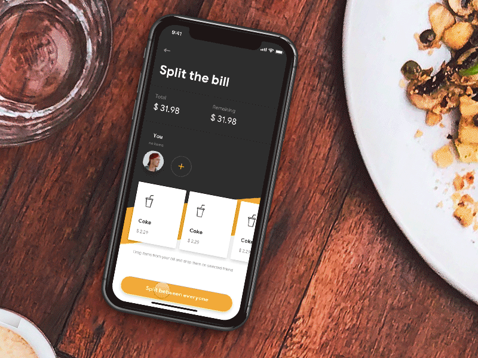

## Info

Eine Präsentation von Daniel Hollenbach & Lukas Bäumchen

    

## Allgemeine Beschreibung

> Don’t let a good idea stay just an idea. ProtoPie is the most intuitive way to prototype and perfect them

ProtoPie beschreibt sich selbst als das intuitivste Prototyping-Tool auf dem Markt. Interaktionen basieren bei ProtoPie auf drei Bausteinen: Object, Trigger und Response. 

  

Dies soll dem User auf ganz einfache Art und Weise den Bau eines interaktiven Prototyps ermöglichen. Außerdem sind natürlich auch die bekannten Features aus diversenen Konkurrenzprodukten wie Adobe XD, Axure usw. mit an Bord. Der Clou an der ganzen Sache ist, dass man via Plugin bereit erstellte Sketches aus Adobe XD und Co. in ProtoPie einbinden kann. Dabei soll das grundsätzliche Nutzen dieser Funktionen einfacher, verständlicher und leichter sein.

## Fidelity

**Interaktivität:**

Mithilfe der oben beschriebenen 3-Phasen-Interaktion (Object,Trigger und Response) lassen sich schnell simple interaktive Prototypen erstellen. 

  

**Visualisierung:**

Die Visualisierung ist natürlich ein ganz wichtiger Teil bei der Erstellung eines Prototypen. ProtoPie bietet dem User eine ganze Palette an Möglichkeiten, um die eigene Idee so umzusetzen, wie man es möchte. Dabei spielt es keine Rolle, ob Bilder, bestimmte Fonts oder Animationen verwendet werden. Somit steht der optimalen Umsetzung fast nichts im Weg.

  

**Content:**

Durch die unzähligen Möglichkeiten, die das Programm einem bietet, kann innerhalb kürzester Zeit ein Prototyp mit Inhalt gefüllt werden. Dabei spielt auch hier wieder die einfache Bedienbarkeit und die schnelle Umsetzung eine große Rolle.

  

  

## Komplexität

  

Der Grundaufbau des Programms ist sehr schlicht und einfach. Am Anfang bekommt man ein kleines Tutorial. Hier wird man durch die Grundfunktionen geführt und kann danach direkt loslegen. Es ist wie man auf dem Bild oben sehen kann, sehr Übersichtlich und man findet sich schnell zurecht. 

  

Durch die Vielseitigkeit, kann man mit ProtoPie viele verschiedene Prototypen kreieren. Egal ob wie in dem oberen Beispiel eine Login Seite/ Interface oder wie in dem unteren Beispiel ein art Shop Übersichtsseite.

  

Man kann den Prototypen selbstverständlich auch Klickbar machen und sich direkt ein Preview davon ansehen. 

## Beispiele

  

## Grenzen

Natürlich gibt es wie in jeder Software auch Grenzen und Einschränkungen. Im Falle von ProtoPie sind das aber nicht besonders viele. Einer der größten ist, dass die Software nicht kostenlos ist. Jeder kann sich eine 30-tägige Testversion herunterladen und muss danach ein Abo abschließen. Dieses kostet 13$ pro Monat. Es gibt die Möglichkeit für Studenten und Lehrbeauftragte die Software, für beispielsweise den Zeitraum des Studiums, kostenlos oder zu reduzierten Konditionen zu nutzen. Dies muss aber nachgewiesen werden. Ein weiterer Aspekt ist die komplexibilität. Es können jegliche Prototypen erstellt und klickbar gemacht werden, dennoch kommt man irgendwann an die Grenzen der Möglichkeiten. Eventuell muss man dann auf eine andere Software umsteigen. Bis dahin bleibt aber viel Luft.   
